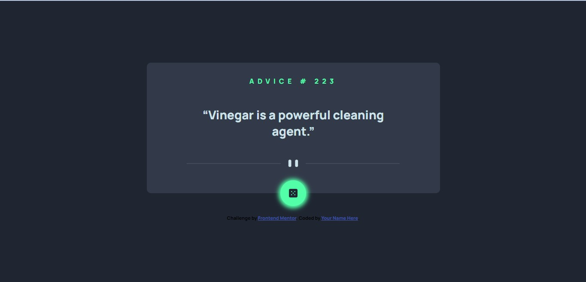

# Frontend Mentor - Advice generator app solution

This is a solution to the [Advice generator app challenge on Frontend Mentor](https://www.frontendmentor.io/challenges/advice-generator-app-QdUG-13db). Frontend Mentor challenges help you improve your coding skills by building realistic projects.

## Table of contents

- [Overview](#overview)

  - [Screenshot](#screenshot)
  - [Links](#links)

- [My process](#my-process)
  - [Built with](#built-with)
  - [What I learned](#what-i-learned)
  - [Continued development](#continued-development)
  - [Useful resources](#useful-resources)

## Overview

### Screenshot



### Links

- Solution URL: [Add solution URL here](https://github.com/TechNech/technech.github.io/tree/main/advice-generator-app-FM)
- Live Site URL: [Add live site URL here](https://technech.github.io/advice-generator-app-FM/index.html)

## My process

### Built with

- Semantic HTML5 markup
- CSS custom properties
- Flexbox
- CSS Grid
- JavaScript

### What I learned

I learned how to fetch data from a JSON API, also I learned about the `<picture>` and `<q>` tags for HTML5

To see how you can add code snippets, see below:

```html
<picture>
  <source media="(max-width: 768px)" srcset="" />
  </picture>

<q id="advice"></q>
```

```js
const fetchAdvice = async () => {
  const res = await fetch("https://api.adviceslip.com/advice");
  const data = await res.json();

  document.getElementById("advice-id").innerHTML = `Advice # ${data.slip.id}`;
  document.getElementById("advice").innerHTML = `${data.slip.advice}`;
};

fetchAdvice();
```

### Continued development

I would like to continue developing this app using new methods.

### Useful resources

- [Resource 1](https://developer.mozilla.org/en-US/docs/Web/CSS/quotes) - This helped me with the quotes section. I really liked this pattern and will use it going forward.
- [Resource 2](https://github.com/SankThomas/vanilla-advice-generator-app) - This helped learn the `<picture>` tag and the JavaScript involved in this app.
